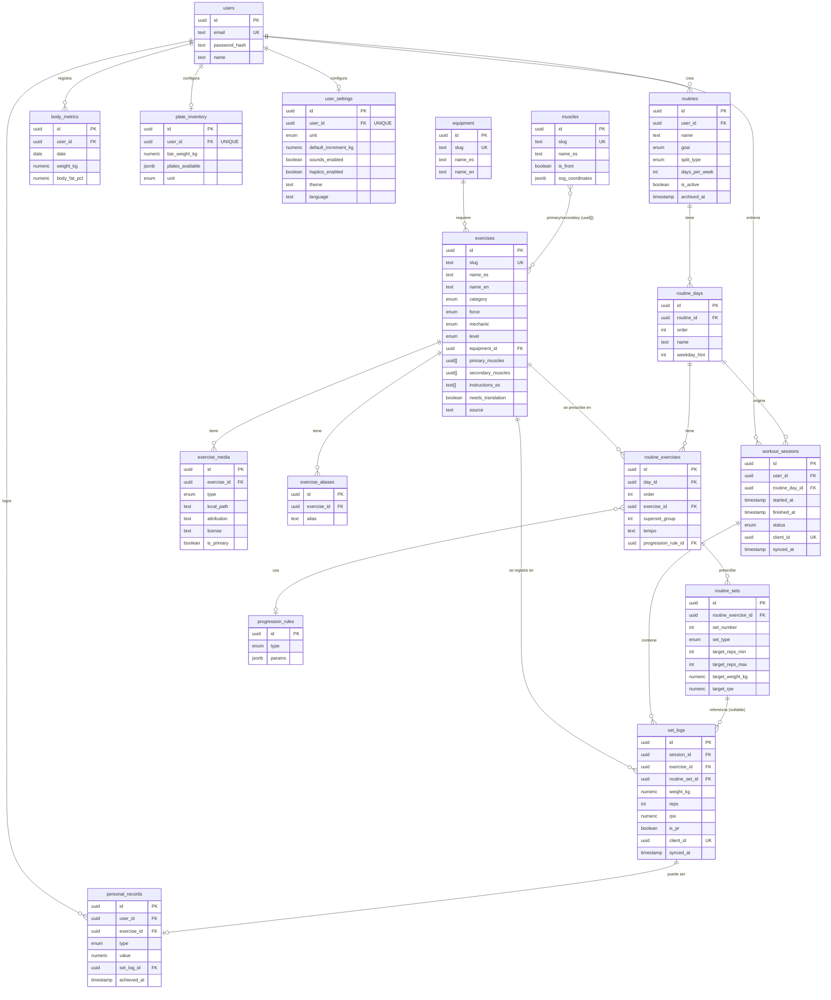

# Schema — Iron Log

17 tablas, definidas en `src/db/schema/*.ts` (Drizzle, SQL-first). Migración generada
en `drizzle/0000_lowly_marvel_apes.sql`. PKs `uuid` generadas con `uuidv7()` en
`src/lib/id.ts` (mismo algoritmo que usará el outbox offline en Fase 5).

## Convenciones

- `created_at` / `updated_at` en todas las tablas.
- `client_id` (uuid v7, `UNIQUE`) + `synced_at` sólo en las tablas que se crean offline
  y sincronizan después: `workout_sessions`, `set_logs`.
- `ON DELETE CASCADE` desde el dueño natural del dato (`users`, `routines`,
  `workout_sessions`) hacia abajo. **Excepción a propósito:** `set_logs.exercise_id`
  y `routine_exercises.exercise_id` son `ON DELETE RESTRICT` — no se puede borrar un
  ejercicio del catálogo si tiene historial o rutinas que lo referencian; el catálogo
  se cura, no se poda a ciegas.
- Borrar una rutina nunca borra `set_logs`: `workout_sessions.routine_day_id` y
  `set_logs.routine_set_id` son `ON DELETE SET NULL`, así el historial de lo que
  realmente se entrenó sobrevive aunque la rutina que lo originó se edite o archive.

## Diagrama ER

## Índices explícitos

| Tabla | Índice | Para |
|---|---|---|
| `workout_sessions` | `(user_id, started_at DESC)` | historial paginado |
| `set_logs` | `(session_id, order)` | reconstruir una sesión en orden |
| `personal_records` | `(user_id, exercise_id, achieved_at DESC)` | gráfica de PRs por ejercicio |
| `routines`, `routine_days`, `routine_exercises`, `routine_sets`, `body_metrics` | por FK padre | listar hijos de un padre sin table scan |

## `muscles` sin FK real en `exercises.primary_muscles[]`

Postgres no soporta FK sobre elementos de un array nativamente. Es una decisión
consciente (no una limitación olvidada): la integridad se garantiza en el seed
(Fase 2), que es la única escritura de este campo — el usuario nunca edita el
catálogo directamente.
